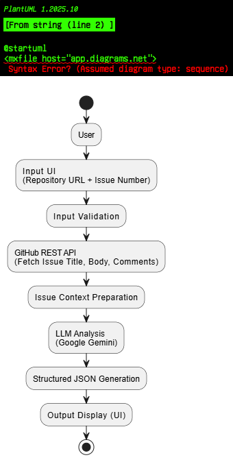

# AI-Powered Github Issue Assistant

## Overview

This project is an AI-powered GitHub Issue Analyzer that fetches issue data from public GitHub repositories and generates structured, actionable insights using a Large Language Model (LLM).

The application converts unstructured GitHub issue discussions into a standardized JSON format to help maintainers and contributors quickly understand issue type, priority, and potential impact.

---


## Core Features

### 1. Input UI
- Simple and clean interface to input:
  - Public GitHub repository URL
  - Issue number
- Built using Streamlit for rapid prototyping and usability.

### 2. Backend Logic
- Lightweight backend implemented in Python.
- Triggers issue analysis based on user input.
- Modular separation of:
  - GitHub API data fetching
  - AI analysis logic
  - UI rendering

### 3. AI Core
- Fetches the following using GitHub REST API:
  - Issue title
  - Issue body
  - Issue comments
- Processes issue context using a Large Language Model.
- Produces output in a strict and consistent JSON schema.

### 4. Output Display
- Displays AI-generated analysis in a clean and readable format.
- Ensures structured visualization of JSON output.

---
## Usage Example (Input and Output)

The following screenshots demonstrate how the application works with real GitHub issues.

## Application Interface

The following screenshot shows the main interface of the application where users provide the repository URL and issue number.


### Input Example
- Repository URL: https://github.com/python/cpython
- Issue Number: 1


### AI-Generated Output

The application fetches the issue title, body, and comments from GitHub and generates a structured JSON analysis using the LLM.


## Error Handling Example

The application includes validation and graceful error handling for incorrect inputs.

### Invalid Repository or Issue Input
- Repository URL: https://gitlab.com/facebook/react
- Issue Number: 1

Expected behavior: The application displays a clear error message indicating that the repository URL is invalid or unsupported.


### Note on JSON Output Format

The application is designed to generate output strictly in the required JSON schema, allowing the result to be directly copied and reused for downstream processing, tooling, or analysis. The pasted output below represents an actual response generated by the system for the given input.

### Verified JSON Output

The following output is copied directly from the application without any manual edits.  
It strictly matches the required JSON schema and is ready for reuse.

```json
{
  "summary": "Update the Misc/NEWS processing logic to support and correctly handle legacy 'bpo-' bug tracker references.",
  "type": "feature_request",
  "priority_score": "2 - Improves internal tooling and changelog consistency for legacy references",
  "suggested_labels": ["tooling", "Misc/NEWS", "enhancement"],
  "potential_impact": "Enables proper tracking and linking of legacy Python bug tracker IDs within the project's changelog system."
}

## REQUIRED JSON Output Format

```json
{
  "summary": "A one-sentence summary of the user's problem or request.",
  "type": "bug | feature_request | documentation | question | other",
  "priority_score": "A score from 1 (low) to 5 (critical), with a brief justification for the score.",
  "suggested_labels": ["label1", "label2", "label3"],
  "potential_impact": "A brief sentence on the potential impact on users if the issue is a bug."
}

```


## Tech Stack and Dependencies

The following technologies and libraries were selected to ensure reliability, simplicity, and rapid development while meeting the project requirements.

| Component        | Version | Purpose                | Advantage                                                                 |
|------------------|---------|------------------------|---------------------------------------------------------------------------|
| Streamlit        | 1.40.0  | Frontend UI            | Enables rapid development of a clean and interactive UI with minimal boilerplate |
| google-genai     | 0.5.1   | LLM SDK                | Provides direct access to Google Gemini models with structured prompt control |
| python-dotenv    | 1.0.0   | Environment management | Allows secure loading of API keys during local development |
| requests         | 2.32.3  | HTTP client            | Lightweight and reliable library for GitHub API communication |


## System Design and Flow

The application is designed as a lightweight AI agent that orchestrates data retrieval, reasoning, and structured output generation.

### High-Level Flow
1. The user provides a public GitHub repository URL and issue number via the UI.
2. The backend validates the inputs and fetches the issue title, body, and comments using the GitHub REST API.
3. The collected issue context is passed to the Large Language Model with a structured prompt.
4. The LLM analyzes the issue and returns a response strictly conforming to the required JSON schema.
5. The structured output is displayed in the UI and can be directly copied for reuse.

This modular design ensures clarity, maintainability, and reliable AI behavior.


## Application Flow Diagram

The following diagram illustrates the end-to-end workflow of the application, from user input to AI-generated structured output.



## Edge Case Handling

The application accounts for common real-world edge cases, including:
- Issues with no comments.
- Invalid or non-GitHub repository URLs.
- Non-existent issue numbers.
- Long issue descriptions that exceed typical context lengths.
- Missing or misconfigured API keys.

In all cases, the application fails gracefully with clear and user-friendly error messages.
